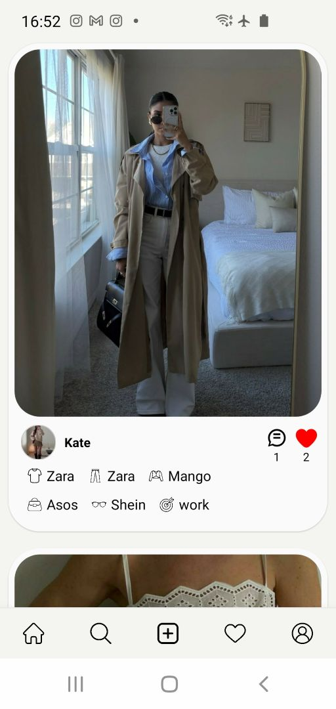
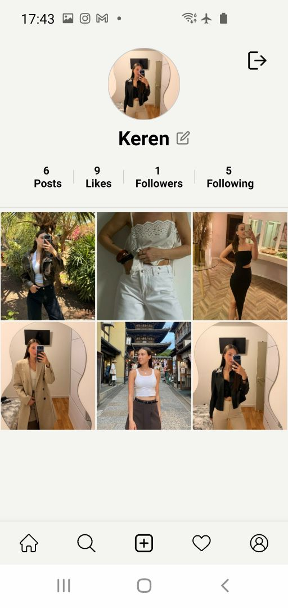
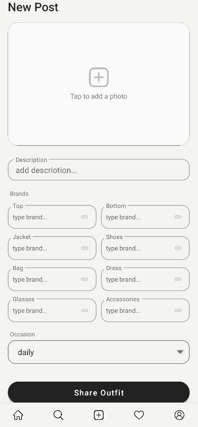
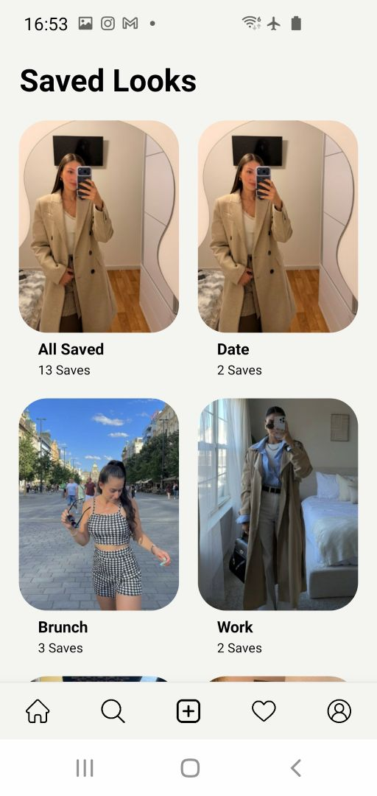
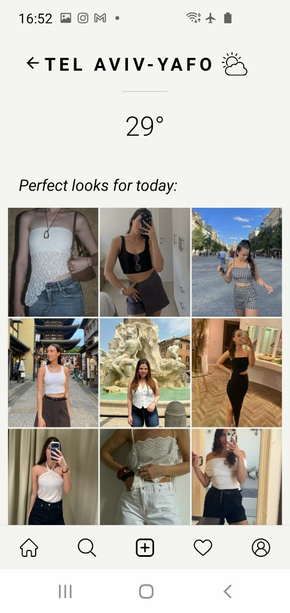
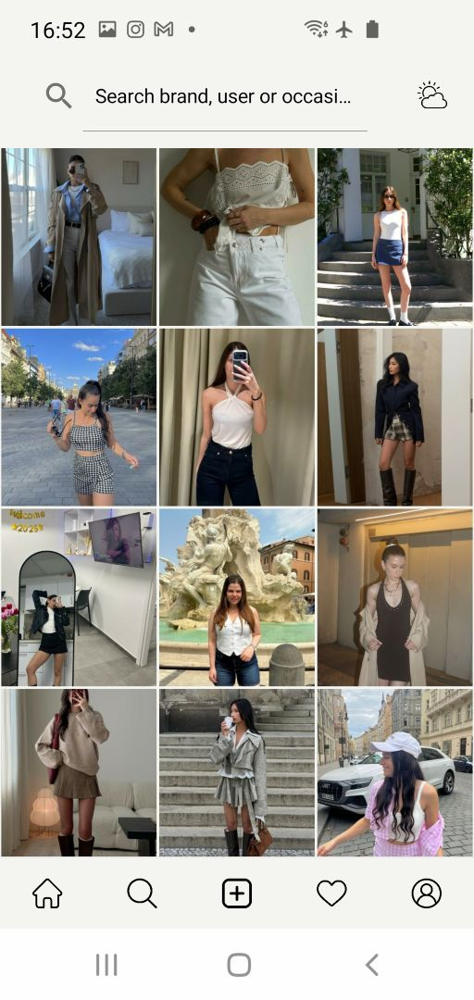

<p align="center">
  
</p>

# STYLISH - The Fashion Social Network

Stylish is a fashion-focused social media Android app. It allows users to share their daily outfits, discover styling inspiration, interact with a community, seamlessly shop for tagged items directly from the feed, and get AI-powered outfit recommendations based on real-time weather.

## ✨ Key Features

### 📸 Social & Community
* **Interactive Feed:** Scroll through a dynamic feed of outfits from around the community.
* **Follow System:** Follow your favorite creators and curate your personalized feed.
* **Likes & Comments:** Engage with posts using an **Optimistic UI** approach for zero-latency like interactions, and leave comments on outfits.
* **User Profiles:** Dedicated profile pages displaying user posts, followers/following counts, with full profile and post editing capabilities.

### 🌍 Discover & Explore
* **Weather Recommendations:** GPS-based weather lookup automatically filters the feed to show outfits perfectly suited for your local conditions today.
* **Real-Time Search:** Instantly filter and discover posts by occasion, specific brands, seasons, user name, or description keywords in real time.
 
### 🤖 AI-Powered Post Creation
* **Smart Weather Categorization:** Integrated with **Google Gemini AI**. When uploading an outfit, the AI analyzes the image and automatically categorizes the outfit's weather suitability (Hot, Warm, Cold).
* **Advanced Image Cropping:** Seamless image selection from the gallery with a built-in interactive cropping tool.
* **Detailed Tagging:** Tag specific brands for every piece of clothing (Tops, Bottoms, Shoes, Bags, Glasses, and Accessories) and specify the occasion.

### 🛍️ "Shop the Look" (In-App Browser)
* **Chrome Custom Tabs Integration:** Clicking on a tagged brand in the feed opens an in-app browser overlay (without leaving the app).
* **Smart URL Parsing:** Converts direct product URLs into clean brand names (e.g., automatically displaying `Mango` from `shop.mango.com/il/shirt`).

## 🛠️ Tech Stack & Architecture

* **Language:** Kotlin
* **Architecture:** MVVM (Model-View-ViewModel) for clean separation of concerns and lifecycle-conscious UI data handling.
* **Asynchronous Programming:** Kotlin Coroutines (`viewModelScope`, `lifecycleScope`) for smooth background processing and API calls.
* **Backend as a Service (BaaS):** Firebase
  * **Firebase Authentication:** Secure user sign-up and login.
  * **Cloud Firestore:** NoSQL database storing users, posts, comments, and relational follow data. Secured with custom Firestore Security Rules.
  * **Firebase Cloud Storage:** Storing and retrieving compressed user avatars and post images.
* **External APIs & Libraries:**
  * **Generative AI SDK (Gemini):** For intelligent image analysis.
  * **OpenWeather API:** For fetching real-time, location-based weather data.
  * **Google Play Location Services:** For accurate, battery-efficient GPS positioning.
  * **Glide:** Fast and efficient image loading and caching.
  * **CanHub Image Cropper:** Modern image manipulation.
  * **AndroidX Browser:** For Chrome Custom Tabs implementation.

## 🚀 Getting Started

### Requirements

- Android 6.0+ (min SDK 23)
- Android Studio Hedgehog or newer
- A Firebase project
- OpenWeather API key
- Google Gemini API key

### Installation & Setup

To run this project locally, follow these steps:

1. **Clone the repo**
   ```bash
   git clone https://github.com/kerenkay/stylish-android-application.git
   cd StylishAndroidApplication
   ```

1. Open the project in **Android Studio**.
2. **Firebase Setup:**
   * Create a project in the [Firebase Console](https://console.firebase.google.com/).
   * Add an Android app and download the `google-services.json` file.
   * Place the `google-services.json` file in the `app/` directory.
   * Enable **Authentication** (Email, Phone, Google), **Firestore**, and **Storage**
3. **API Keys Setup:**
   * Get a free API key from [Google AI Studio](https://aistudio.google.com/) for Gemini.
   * Get a free API key from [OpenWeatherMap](https://openweathermap.org/) for weather data.
   * Add your API keys to your `local.properties` file:
     ```properties
     GEMINI_API_KEY=your_gemini_api_key_here
     WEATHER_API_KEY=your_openweather_api_key_here
     ```
4. **Build and run**
   * Open the project in **Android Studio**.
   * Build and run the app on an emulator or physical device (Location services must be enabled on the device for the weather feature).

## Project Structure

```
app/src/main/java/com/example/stylish_android_application/
├── adapter/        # RecyclerView adapters (posts, comments, users, profile grid)
├── model/          # Data classes: Post, User, Comment
├── repository/     # PostRepository, UserRepository (with in-memory cache)
├── ui/             # Activities and Fragments
│   ├── LoginActivity
│   ├── MainActivity          (bottom navigation host)
│   ├── FeedFragment
│   ├── AddPostFragment / EditPostFragment
│   ├── ProfileFragment
│   ├── SearchFragment
│   ├── WeatherFragment
│   ├── PostDetailsFragment
│   ├── CommentsBottomSheet
│   ├── LikesFragment
│   └── FollowListFragment
├── viewmodel/      # One ViewModel per screen
└── utils/          # BrandHelper, BrandFormHelper, ImageUtils, AppDialogs
```

## Firestore Schema

```
users/{userId}
  username, profileImageUrl, followers[], following[], ...

posts/{postId}
  userId, imageUrl, occasion, weatherCategory (Hot/Warm/Cold)
  brands: { top, bottom, jacket, shoes, bag, dress, glasses, accessories }
  brandLinks: { item -> "Name || URL" }
  likes[], commentCount, timestamp
```

## Screens

| Screen | Description |
|---|---|
| Login | Firebase Auth UI with email, phone, and Google sign-in |
| Feed | Paginated timeline (10 posts per page), pull-to-refresh |
| Add / Edit Post | Image picker with 1:1 crop, brand autocomplete, occasion dropdown, AI tagging |
| Search | Real-time filter by occasion, brand, or keyword |
| Weather | Fetches GPS location → weather → filters posts by weather category |
| Profile | Post grid, stats, follow/unfollow, edit name and photo |
| Post Details | Full outfit info with clickable brand links |
| Comments | Bottom sheet with real-time comment list |
| Likes | All posts the current user has liked |

## 📸 Screenshots

| Home Feed | Profile | Add Post |
| :---: | :---: | :---: |
|  |  |  |

| Saved | Weather Feed | Search |
| :---: | :---: | :---: | 
|  |  |  | 
## License

This project is for personal / educational use.
   
